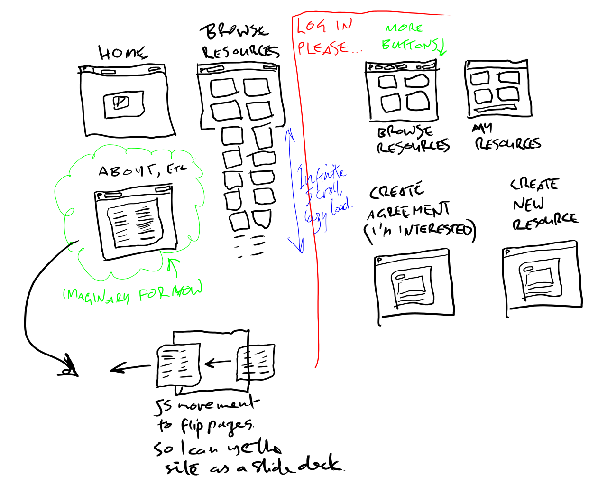
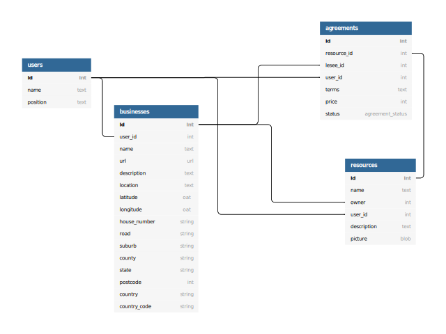

# Partage
## A new platform for small businesses to share underutilized assets for mutual benefit.
### *Partage*, from Latin *partire*: The act of dividing a thing into portions. Sharing something with someone.
*(Larousse dictionary)*  

## Web app in development - dev version live at:
https://desolate-river-21658.herokuapp.com/  
source code:  
https://github.com/adrian-sal-kennedy/partage  

## What is the purpose of Partage?

Having run a micro-business involving the keeping of stock and equipment and starting from nothing, I'm acutely aware of the practical problem of scale-up.  

### A familiar (to me) example:
- My business has a retail product that it has developed. It is innovative, high quality and we want to be able to sell it everywhere.  
- We have a minimum of equipment to be able to serve the entire country (it is a slow-moving product and people typically buy small amounts, so a little hardware goes a long way in a place with low population). Our estimate was based off a measure of how long it takes a line of two people to get through *n* units in a workday.  
- We don't have enough room for the stock if we made it this fast.  
- We don't have our own commercial kitchen.  
- We don't have our own warehousing that can handle import/export quarantine areas as well as finished stock. Not for a whole country.  

The obvious choice is to rent or buy this space. Here's a problem:  
- Renting a warehouse costs far more than our revenue is likely to be until we are already selling nationwide.  
- We would need a kitchen, get it HACCP certified, buy a forklift, hire a driver for it, get security, etc etc.  

We don't have that kind of money.  

### Another familiar example:
- My business was in a good position to get finance and so we bought up what we needed to produce at a scale that will keep us well-off for life.  
- We are not at that scale yet.  
- We have a warehouse that's 20% full, a kitchen we use 4 days a week and very big bills every month.  

### It would be great if the two above cases could find a way to work together...  

## Partage is a two-sided marketplace that allows businesses to support each other and benefit mutually.  

The concept is very simple. A business places an ad up on the site - call it a "resource" because it can be anything. An office. An edit suite. Even an employee that is not as busy as they (and you) would like. Another business browses a list of these resources and finds you. Now they can take up some of your slack.  

Small business is typically very guarded about their stuff. It is understandable that people would not want randoms coming in and out of their space, looking at all the super secret stuff that is going to make them all rich. This is why Partage's business model includes, and the platform will grow to include, legal documents in a convenient and relevant form.  

A person browsing resources for hire will not see your business name or address - only the resource name, description, and/or picture you provide, along with the suburb and local council. Privacy is important and until contact and agreement is made, information should be minimal.  

If your workplace is in Darebin and is food-related, we will provide links to necessary contacts and forms. Entering your address (in a human readable way) will trigger a search of the relevant council for the relevant business category.  

Template legal documents allow such things as Non-Disclosure Agreements between potential resource-sharers. 

When a resource is placed on the marketplace, no price is set - that is for you and your new ally to negotiate. When a business expresses interest, an "agreement" is generated - in a "pending" state - for you to review and bounce back-and-forth with the other party. 

Partage's purpose is to facilitate connections. We have no need to collect data beyond what a user sees with their own eyes on the app. Partage's creator is it's own target customer-base.

## Business model  

Partage needs to pay it's own bills. There are three ways to monetize this service that ensure fairness and sustainability:  
1. Pay on agreement
    - The resource lister and resource hirer split a small fee between them automatically.
2. Pay to list a resource
    - The lister pays a small fee gets priority placement (when the app is feature complete, resources shall be sorted by proximity to the user, but this works per-council to preserve anonymity). The lister still pays the same fee as above (time-wasters are a thing and payment is usually a good way to prevent such things).  
3. Premium subscription (with support from Partage)
    - Legalities and compliance issues are taken care of by us in return for a subscription fee. Listings by the Premium user are given priority placement. This of course requires Partage to be feature-complete and resourced enough to provide legal help so it will not be available initially.  

## Technical summary:

- Built on Ruby On Rails, Postgres SQL.
- Deployment of dev version on Heroku, linked to github.
- Storage on AWS bucket.
- UI built with custom Sass

## Features:

- User can manage multiple *Businesses*.
- Businesses require only a name to be usable. Other details like ABN, ACN etc are not our concern. You can register your back shed if you like. An address is recommended as it helps more relevant users find you.
- User can manage multiple *Resources*, each belonging to one business.
- Resources can have a picture, description and a name. They relate to both a *Business* and a *User*
- Addresses need only be as accurate as Google maps needs - it will look it up and find the fiddly stuff itself (I hate googling for postcodes and it's really not a needed thing. Geocoding finds all that automatically).
- Businesses create *Agreements*, which simply hold the terms of the agreement in text and a price that's agreed upon. They relate to a *Resource*, two *Businesses* and a *User*.

## Planned features:

- Businesses should be able to have many users - people leave companies and join others but the business stays.
- Agreements are currently not fleshed out and a little broken.
- Payments are only half implemented. They were not core to the app's utility but certainly core to making Partage a viable business venture of it's own.
- TESTING. There are no unit tests at all I'm afraid.
- Admin mode. Analytics, dashboard, CRUD for users etc. Definitely need this.
- Expand geocoding - auto-sort listed resources by location (suburb/council first to preserve some anonymity of the businesses involved).
- Search by council - this is important as they can have different rules so businesses will want to base their decisions on being in friendlier councils.
- Document lookup, such as food safety officer contacts, council forms if available, etc. These should be relevant to the category of business or resource on offer, so there will need to be relevant database fields for this.
- Heavy UI/UX work. It looks nice enough now but necessarily has to change as function is implemented to ensure a good experience for users.
- Switch to bootstrap. As much as I love building a nice library of CSS stuff, it just makes sense to use an existing framework before I get bogged down reinventing several wheels.
- Different statuses (via postgres Enum) to reflect and notify Resource owner that a change is requested. An Agreement object should go from "interested" to "negotiating" to "signed off" to "terminated", etc.
- Lazy loading - this will be very important as the site gets more users! Right now it will infinite scroll using an infinite number of database queries. This is not scalable.
- Comments, feedback, (private) ratings and reviews. Trust is going to be a bit of a weakness given the nature of many business owners in Australia.

## Sitemap

*Note - Orange zone means logged out or no user account, green means logged in.*  
*UI is shown as mobile/small screen interface to keep the diagram viewable. Browse screens are shown in desktop mode so they can represent a bit more than a single-column mobile view.*

## User stories

### *"As a founder of a start-up food business, I need a way to find some commercial kitchen space in a council I choose, so I can spend less on compliance theatre and more on actual good practices."*
This is a pretty common problem. In Victoria, food permits are issued by council rather than state, and quite often they overinterpret some rules to the point of absurdity. Start ups often work out of their own home kitchens, but this is not optimal in any way, and you're stuck with the regulations where you live, having to modify your own house to meet their often contradictory whims.

This problem is solved using thoughtful use of the Geocoder gem for Rails - openstreetmap holds "county" information, which in Australia resolves to the shire name (like "City Of Boroondara, etc). This is accessible once your record has GPS coordinates and is "reverse-geocoded". This all happens on input validation after the user clicks "submit" and before the record is written to the database. They supply a reasonably free-form address (like "22 buckley st carnegie" - no postcode, no country code, just enough to make it unique) and Geocoder finds it and stores both coordinates and details in their own fields (street number, street name, suburb, county, state, country).

The user searching for a kitchen will only see the suburb and council names.

### *"As a struggling business owner, I want to hire out my gear because it's only used half the time but costs the same to keep. This way it wont cost any extra but at least it's earning me something when I don't need it."*

A business owner can list anything at all as a resource for hire - even human resources if need be. An idle forklift and a bit of warehouse space are extremely useful things and you can arrange with a Partage customer how to safely share these things and keep peace of mind.

### *"As a pretty paranoid guy who's been burnt before, I want assurance that if something bad happens to my stuff, I'll be covered."*

Partage, when feature-complete, will provide links to all the necessary paperwork, and with a premium account aims to also provide insurance and legal help as required and relevant.

### *"I need a way to make sure I can trust the people I'm dealing with."*

Once feature-complete, all agreements will have a full history. Users will be able to message each other and anonymously review each other. Reviews can also be invisible - this will effectively weight the search algorithm based on rating. Such features will likely only be noticable when there are a lot of users.

Template forms are to be built in from the beginning, and shall include NDA and similar so that parties have recourse if IP is stolen or suspected to be. This will also help protect people in case they are accused in bad faith.

## Wireframes
These are pretty basic for a number of reasons - I'd just discovered "Write!" and figured that's a much more fluid way to dump my brain into the computer with my wacom, and the UI itself is anticipated to change quite a lot in response to the needs of the market. I like a "node-based" approach where each listing is a unit rather than a row on a page. The information that is required while browsing is minimal and I would like to keep text to a minimum.

## Entity Relationship Diagram

Core function depends only on these tables and these relationships. The schema also contains tables for payment processing and image handling.

## High level components and abstractions
This project is built on Rails, hence every database table has it's own Class that inherits from ApplicationRecord which in turn inherits from ActiveRecord::Base. ActiveRecord is a Ruby module that is a core part of Rails. It provides a way to translate Ruby commands into database query languages (SQL).

All views are called by a Controller class that inherits from Rails' ApplicationController which in turn inherits from ActionController. HTTP requests go through routes.rb and call ActionController actions, defined as methods in each Controller object (index, show, edit, create, update etc). The controllers also make the necessary requests of the Model objects which supply data from the Postgres SQL database.

User Authentication is handled by the Devise gem - this abstracts away a lot of sensitive and tricky procedures that not only would it be outside the scope of this project to implement from scratch, but the chances of doing it without creating security exploits are very high. Abstraction in this case not only makes things quicker to build, but also limits my liability in case of a future data breach.

User Authorization (permission) is managed by CanCanCan, a fork of the old CanCan Ruby gem. Again this allows rapid development and enhances security. Miles of code are reduced to a few lines and a config file.

Geocoding is an important part of this project, and is managed by the Geocoder gem. This is helpful as I can easily choose between OpenStreetMap or Google's API. It exposes various address fields so the App can do things like search by location, or in future use a webscraper on local government websites to provide relevant forms for the resources listed on the App. 

Image upload and S3 storage is handled by ActiveStorage. Active storage provides the ability to upload to many cloud services or locally with a simple config option - all the fiddly code is abstracted away to allow rapid development.

## Third party services

- AWS S3 (for storing images)
- Stripe (for processing payments)
- Google Maps API and/or OpenStreetMap (for location services)
- Github (for remote source control)
- Heroku (for deployment of the app, linked to the git branch "deploy-heroku" rather than "master", just as an extra protection against accidental breakage)

## Models and relations
- *User* model
  - has many "businesses"
  - has many "resources"
  - has many "agreements"  
  It may not be entirely necessary to link all three models to Users - I need to refactor, because some of these were created simply to fix permission issues that could likely be fixed better after MVP.  
- *Business* model
  - has one "user" (for now)
  - has many "resources"
  - has many "agreements"
- *Resource* model
  - has one "business"
  - has many "agreements"
- *Agreement* model
  - has two "businesses"
  - has one "user"  
  Agreements need a whole lot of work at this point. I'm certain it isn't optimal.

## Project management

This project was quite large in scope, partly because I set a large goal - I want this project to be useful and viable. I could really have used such a thing when starting out with my partner years ago.

As a consequence, a Kanban style management model was useful because new features could be added easily and scope can shift by simply moving a card that represents a task.

For early stage debugging it proved a good way to track bugs as well, though such a thing would not scale well as this project grows beyond MVP.

Typically in addition to using Trello to track where I'm at with individual tasks, I would perform an overall check when I'm away from my computer using the Trello phone app. This allowed better perspective and avoided the temptation to jump on and start coding when I really needed to be focusing on higher level tasks.

Below is an active board, but you should be able to see it if you have a Trello account.

https://trello.com/invite/b/LblOy88Q/a82676f70af9401ecc5c0d7758360a4c/partage-app